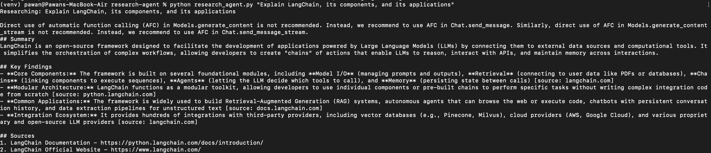

# AI Research Agent

A command-line research assistant that takes a question, uses Google's Gemini model, and returns a structured research report with a summary, key findings, and sources.

## 📌 Project Description

- Accepts a research question as a command-line argument and returns a well-structured report (Summary, Key Findings, Sources).
- Uses a strict system prompt to force the model into a consistent, clean output format instead of free-form rambling answers.
- Built on Google's `google-genai` SDK, making it lightweight with minimal dependencies.
- Designed as a simple, extensible base project — grounding, streaming, or multi-model support can be added later.

## 🛠️ Tech Stack

| Tech | How it's used in this project |
|---|---|
| **Python 3.11** | Core language the entire script is written in. |
| **google-genai** | Official Python SDK used to call the Gemini API and generate the research report. |
| **python-dotenv** | Loads the `GEMINI_API_KEY` securely from a local `.env` file instead of hardcoding it. |
| **Gemini API (`gemini-3.1-flash-lite`)** | The LLM that actually processes the question and generates the report content. |

## 🔑 How to Create and Use the API Key

- Go to [Google AI Studio](https://aistudio.google.com/) and sign in with your Google account.
- Click on **"Get API Key"** → **"Create API Key"** and copy the generated key.
- In the project root, create a file named `.env` (this file is git-ignored and should never be committed).
- Add your key to it in the following format:
  ```
  GEMINI_API_KEY=your_api_key_here
  ```
- The script automatically loads this key at runtime using `load_dotenv()` and passes it to `genai.Client(api_key=...)`.

## ⚠️ Challenges I Faced

- The biggest issue was this single line in the config:
  ```python
  tools=[types.Tool(google_search=types.GoogleSearch())]
  ```
  It kept throwing errors repeatedly, and it took me **2–3 hours** to pin down that this line itself was the actual problem.
- Along the way, I suspected the issue was with the **model** I was using, thinking it might not be available on the free tier — so I tried switching between a few different Gemini models, but the error persisted regardless.
- Eventually figured out the tool/grounding configuration was the culprit. **Commenting it out fixed the issue immediately**, and the script started working correctly.
- The actual error I kept running into (for reference):
  ```
  google.genai.errors.ClientError: 429 RESOURCE_EXHAUSTED.
  {'error': {'code': 429, 'message': 'You exceeded your current quota, please check your plan and billing details...'}}
  ```
- **Lesson learned:** a `429 RESOURCE_EXHAUSTED` error can be misleading — it looked like a plan/billing/model-availability issue, but was actually tied to the extra tool (Google Search grounding) hitting a separate quota, not the base generation call.

## ▶️ How to Run This Project on Your System

- **Clone the repository**
  ```bash
  git clone https://github.com/pwnFirstGit/Research_Agent_gemini.git
  cd research-agent
  ```
- **Create and activate a virtual environment**
  ```bash
  python3 -m venv venv
  source venv/bin/activate      # on macOS/Linux
  venv\Scripts\activate         # on Windows
  ```
- **Install dependencies**
  ```bash
  pip install -r requirements.txt
  ```
- **Add your API key**
  - Create a `.env` file in the project root and add:
    ```
    GEMINI_API_KEY=your_api_key_here
    ```
- **Run the script** with a research question as an argument
  ```bash
  python research_agent.py "Explain LangChain, its components, and its applications"
  ```

### 📸 Sample Output



## 🚀 Possible Future Improvements

- Re-enable and properly configure Google Search grounding (`types.GoogleSearch()`) once quota/billing is set up correctly.
- Add support for exporting the report to a file (Markdown/PDF) instead of just printing to console.
- Add a `--model` flag to let users switch between Gemini models at runtime.
- Add basic error handling/retry messaging specifically for `429` quota errors so it's clearer to the user what went wrong.
